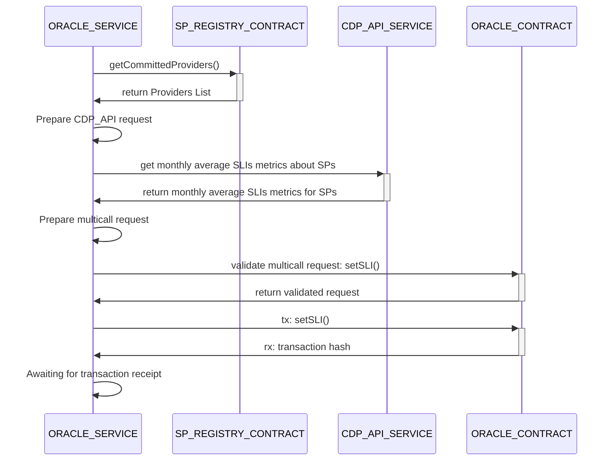
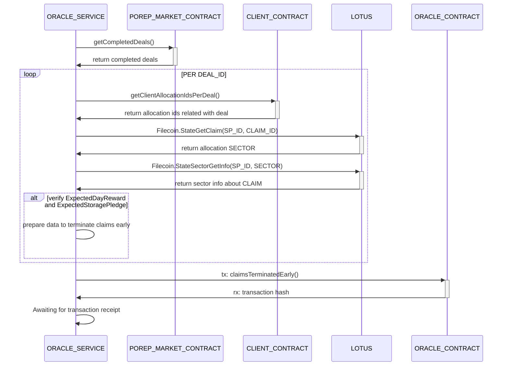
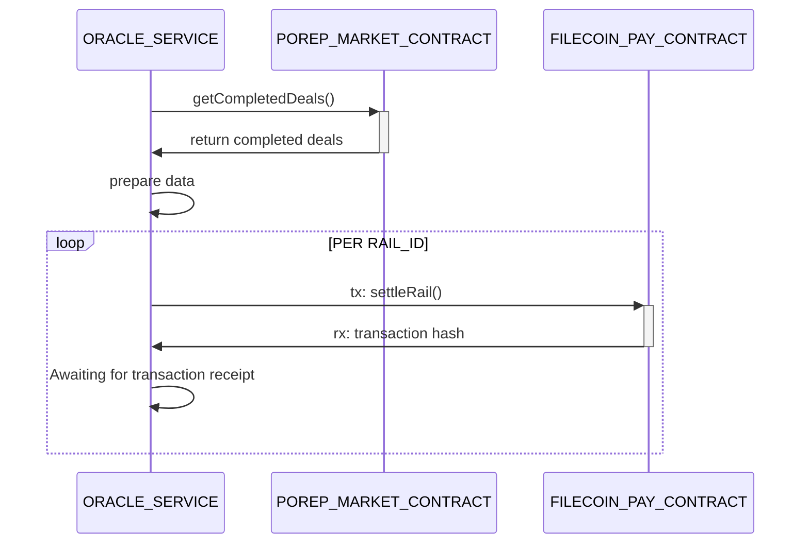
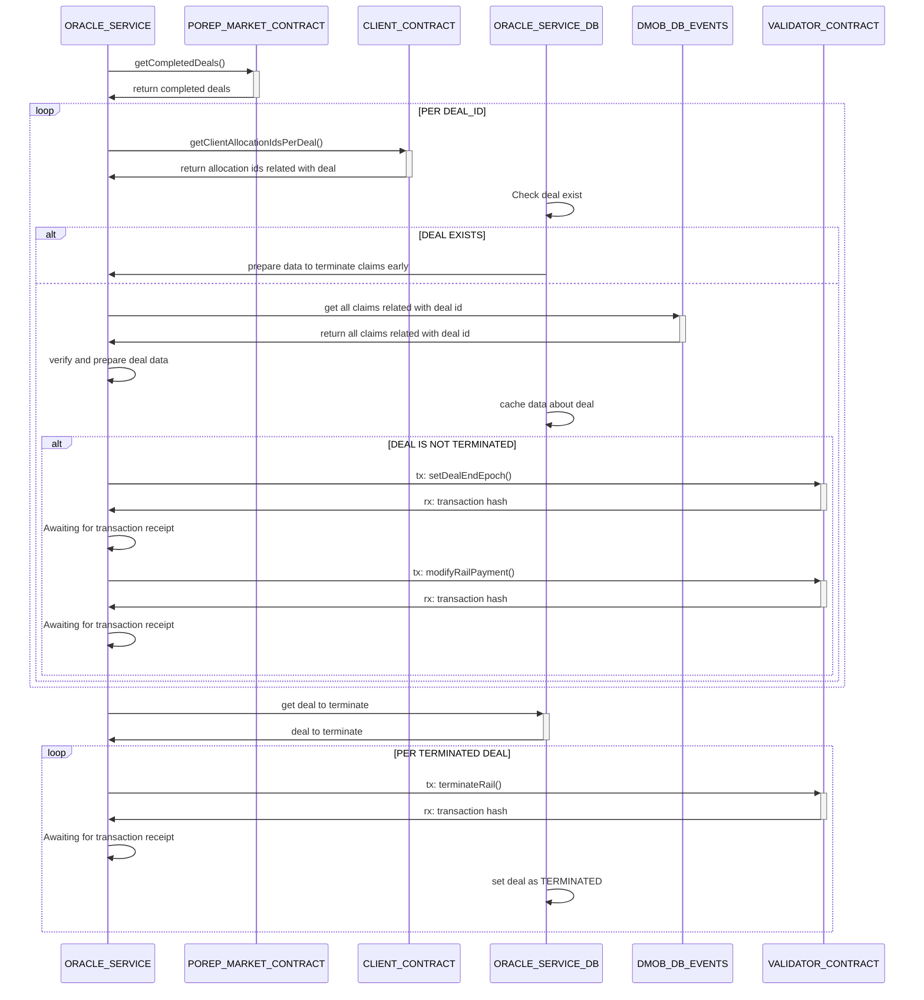

# filecoin-oracle-service

## Diagrams:

1. Storing SLI's on a chain JOB

```mermaid
sequenceDiagram
    ORACLE_SERVICE->>+SP_REGISTRY_CONTRACT: getCommittedProviders()
    SP_REGISTRY_CONTRACT->>-ORACLE_SERVICE: return Providers List

    ORACLE_SERVICE->>ORACLE_SERVICE: Prepare CDP_API request

    ORACLE_SERVICE->>+CDP_API_SERVICE: get monthly average SLIs metrics about SPs
    CDP_API_SERVICE->>-ORACLE_SERVICE: return monthly average SLIs metrics for SPs

    ORACLE_SERVICE->>ORACLE_SERVICE: Prepare multicall request

    ORACLE_SERVICE->>+ORACLE_CONTRACT: validate multicall request: setSLI()
    ORACLE_CONTRACT->>-ORACLE_SERVICE: return validated request

    ORACLE_SERVICE->>+ORACLE_CONTRACT: tx: setSLI()
    ORACLE_CONTRACT->>-ORACLE_SERVICE: rx: transaction hash

    ORACLE_SERVICE->>ORACLE_SERVICE: Awaiting for transaction receipt
```

2. Track claims terminated early JOB

```mermaid
sequenceDiagram
    ORACLE_SERVICE->>+POREP_MARKET_CONTRACT: getCompletedDeals()
    POREP_MARKET_CONTRACT->>-ORACLE_SERVICE: return completed deals

    loop PER DEAL_ID
        ORACLE_SERVICE->>+CLIENT_CONTRACT: getClientAllocationIdsPerDeal()
        CLIENT_CONTRACT->>-ORACLE_SERVICE: return allocation ids related with deal

        ORACLE_SERVICE->>+LOTUS: Filecoin.StateGetClaim(SP_ID, CLAIM_ID)
        LOTUS->>-ORACLE_SERVICE: return allocation SECTOR

        ORACLE_SERVICE->>+LOTUS: Filecoin.StateSectorGetInfo(SP_ID, SECTOR)
        LOTUS->>-ORACLE_SERVICE: return sector info about CLAIM

        alt verify ExpectedDayReward and ExpectedStoragePledge
            ORACLE_SERVICE->ORACLE_SERVICE: prepare data to terminate claims early
        end


    end

    ORACLE_SERVICE->>+ORACLE_CONTRACT: tx: claimsTerminatedEarly()
    ORACLE_CONTRACT->>-ORACLE_SERVICE: rx: transaction hash

    ORACLE_SERVICE->>ORACLE_SERVICE: Awaiting for transaction receipt
```

3. Settlement bot JOB - settleRail on filecoin pay

```mermaid
sequenceDiagram
    ORACLE_SERVICE->>+POREP_MARKET_CONTRACT: getCompletedDeals()
    POREP_MARKET_CONTRACT->>-ORACLE_SERVICE: return completed deals

    ORACLE_SERVICE->>ORACLE_SERVICE: prepare data

    loop PER RAIL_ID
        ORACLE_SERVICE->>+FILECOIN_PAY_CONTRACT: tx: settleRail()
        FILECOIN_PAY_CONTRACT->>-ORACLE_SERVICE: rx: transaction hash

        ORACLE_SERVICE->>ORACLE_SERVICE: Awaiting for transaction receipt
    end
```

4. Terminate deal JOB

```mermaid
sequenceDiagram
    ORACLE_SERVICE->>+POREP_MARKET_CONTRACT: getCompletedDeals()
    POREP_MARKET_CONTRACT->>-ORACLE_SERVICE: return completed deals

    loop PER DEAL_ID
        ORACLE_SERVICE->>+CLIENT_CONTRACT: getClientAllocationIdsPerDeal()
        CLIENT_CONTRACT->>-ORACLE_SERVICE: return allocation ids related with deal

        ORACLE_SERVICE_DB->>ORACLE_SERVICE_DB: Check deal exist

        alt DEAL EXISTS
            ORACLE_SERVICE_DB->>ORACLE_SERVICE: prepare data to terminate claims early
        else
            ORACLE_SERVICE->>+DMOB_DB_EVENTS: get all claims related with deal id
            DMOB_DB_EVENTS->>-ORACLE_SERVICE: return all claims related with deal id
            ORACLE_SERVICE->>ORACLE_SERVICE: verify and prepare deal data

            ORACLE_SERVICE_DB->>ORACLE_SERVICE_DB: cache data about deal

            alt DEAL IS NOT TERMINATED
                ORACLE_SERVICE->>+VALIDATOR_CONTRACT: tx: setDealEndEpoch()
                VALIDATOR_CONTRACT->>-ORACLE_SERVICE: rx: transaction hash
                ORACLE_SERVICE->>ORACLE_SERVICE: Awaiting for transaction receipt

                ORACLE_SERVICE->>+VALIDATOR_CONTRACT: tx: modifyRailPayment()
                VALIDATOR_CONTRACT->>-ORACLE_SERVICE: rx: transaction hash
                ORACLE_SERVICE->>ORACLE_SERVICE: Awaiting for transaction receipt
            end
        end

    end

    ORACLE_SERVICE->>+ORACLE_SERVICE_DB: get deal to terminate
    ORACLE_SERVICE_DB->>-ORACLE_SERVICE: deal to terminate

    loop PER TERMINATED DEAL

        ORACLE_SERVICE->>+VALIDATOR_CONTRACT: tx: terminateRail()
        VALIDATOR_CONTRACT->>-ORACLE_SERVICE: rx: transaction hash
        ORACLE_SERVICE->>ORACLE_SERVICE: Awaiting for transaction receipt

        ORACLE_SERVICE_DB->>ORACLE_SERVICE_DB: set deal as TERMINATED
    end
```
