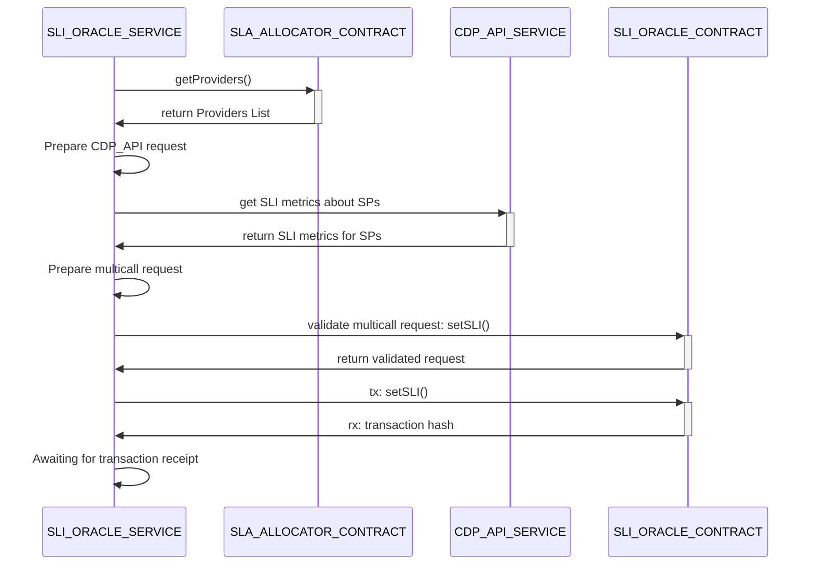

# filecoin-oracle-service

## Diagrams:
1. Storing SLI's on a chain

```mermaid
sequenceDiagram
    SLI_ORACLE_SERVICE->>+SLA_ALLOCATOR_CONTRACT: getProviders()
    SLA_ALLOCATOR_CONTRACT->>-SLI_ORACLE_SERVICE: return Providers List

    SLI_ORACLE_SERVICE->>SLI_ORACLE_SERVICE: Prepare CDP_API request

    SLI_ORACLE_SERVICE->>+CDP_API_SERVICE: get SLI metrics about SPs
    CDP_API_SERVICE->>-SLI_ORACLE_SERVICE: return SLI metrics for SPs
    
    SLI_ORACLE_SERVICE->>SLI_ORACLE_SERVICE: Prepare multicall request

    SLI_ORACLE_SERVICE->>+SLI_ORACLE_CONTRACT: validate multicall request: setSLI()
    SLI_ORACLE_CONTRACT->>-SLI_ORACLE_SERVICE: return validated request

    SLI_ORACLE_SERVICE->>+SLI_ORACLE_CONTRACT: tx: setSLI()
    SLI_ORACLE_CONTRACT->>-SLI_ORACLE_SERVICE: rx: transaction hash

    SLI_ORACLE_SERVICE->>SLI_ORACLE_SERVICE: Awaiting for transaction receipt
```

    
    
